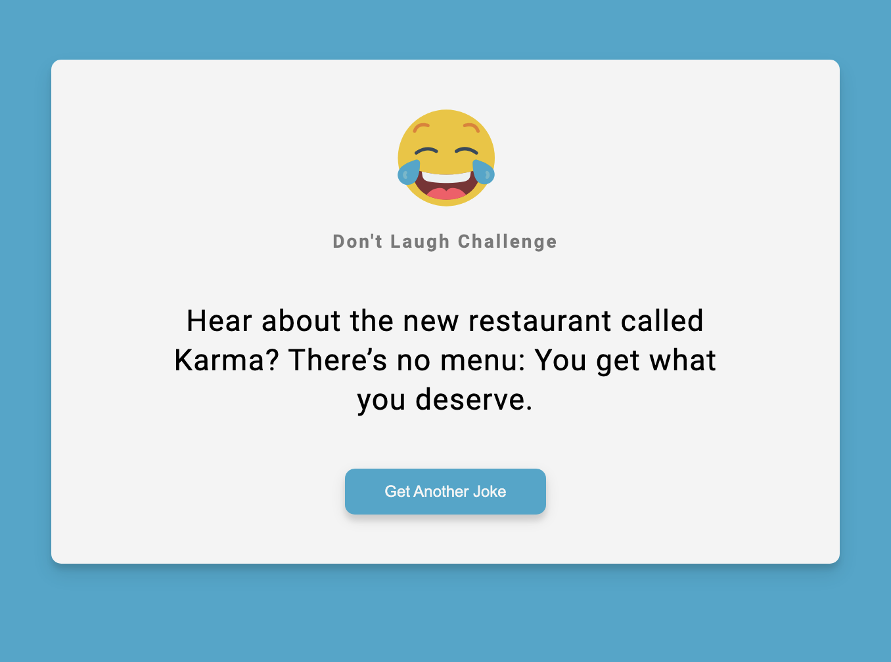

# Webpack Joke Generator

This project shows that basic functionality of webpack for Frontend Development. The application is a simple joke generator using an API. Throughout the code will contain detailed notes on each configuration segment within the webpack bundle.

## Table of Contents

- [Notes](#notes)
- [Installation](#installation)
- [Usage](#usage)
- [Links](#links)
- [Contributing](#contributing)
- [License](#license)

## Notes

The Source file is where all of developer's code goes.
 
The Distribution file is where the static assets are built to.
 

`Initializing and Creating a webpack:`

    - `mkdir [new directory/ app name]`
     
    - `cd [new directory]
     
    - `mkdir src`
     
    - `cd src`
     
    - `touch index.js`
     
    - open terminal to app in vscode and enter `npm init -y`
     
    - `npm i -D webpack webpack-cli`
     
    - Create new script in package.json file called "build": "webpack".
     
    - Create webpack config file named "webpack.config.js" for configuring the webpack bundle.

## Installation
Step 1: Clone repository.
 
Step 2: Install Nodejs.
 
Step 3: Install a source-code editor like VsCode.
 
Step 4: Nodemon is recommended in order to refresh and see updated notes data.

## Usage
Step 1: Open VsCode(preferred) or another source-code editor if not already running.
 
Step 2: Open integrated terminal once in the main folder.
 
Step 3: "run npm i" / "sudo npm i" in the terminal to install the required dependencies.
 
Step 4: Now to run the application, Enter "npm run dev" for webpack live server.
 
Step 5: After the `webpack 5.91.0 compiled successfully in 1815 ms` appears in the console, open the local host URL that's displayed in the console.

## Links
Screenshots:

## Contributing

This project was made with the help of Traversy Media via [youtube](https://www.youtube.com/watch?v=IZGNcSuwBZs&t=1028s).

## Questions:
For additional questions or concerns, feel free to contact me via [prismhead26@gmail.com](http://prismhead26@gmail.com). 
You can also find me on Github at [prismhead26](https://github.com/prismhead26).

© 2024 Aiden Wahed. All Rights Reserved.